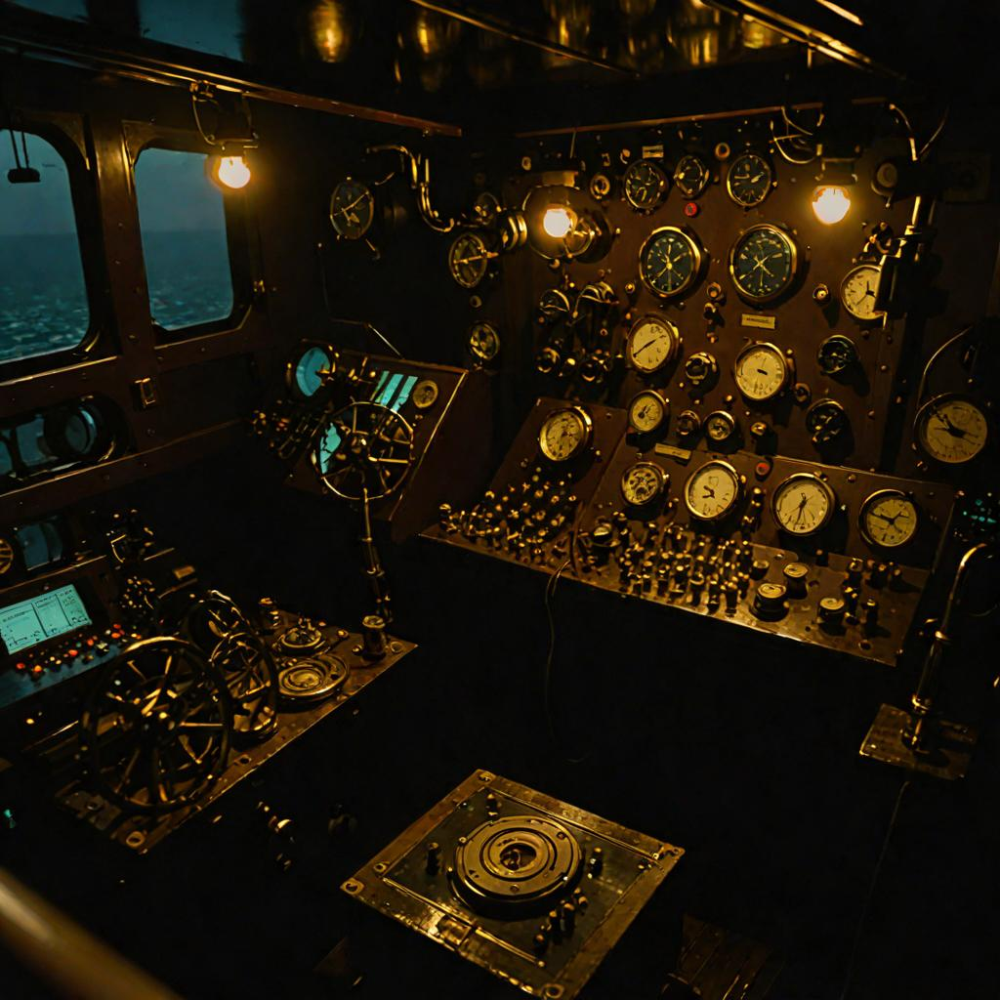

# captain-console

**The captain speaks here. Notes go to the ledger, the ship's computer answers, and the words are kept.**

  

Casey's input worker. A single console surface where the captain drops notes, dictations, and pinches from the field — everything lands in a D1 ledger, TTS gets pincher-cached in R2, and a bearer token keeps the bridge private. One door into the ship, one record of everything said through it.

Built as a Cloudflare Worker:

- **D1** (`DB`) — the notes ledger, append-only and queryable
- **R2** (`CACHE`) — TTS pincher-cache (verified live MISS→HIT)
- **KV** (`INDEX`) — fast lookups into the ledger
- **Workers AI** (`AI`) — speech synthesis

Bearer auth on every route. sha256 + ReadableStream verified in production.

---

## Imagery

- `assets/images/hero-captain-console.jpg` — imagery: gallery-captain-console (owned pipeline, SDXL + nighttime LoRA, seed 42). Warm instruments in the dark, navy + amber, seen from inside.
